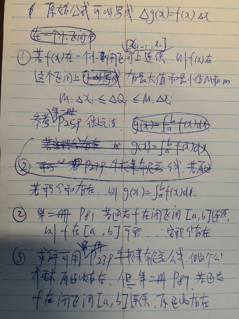
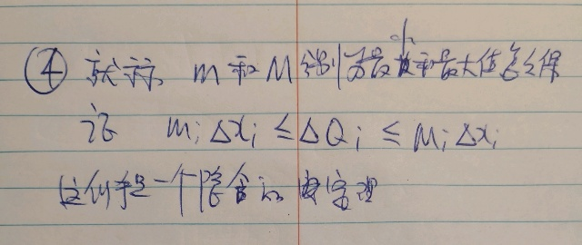
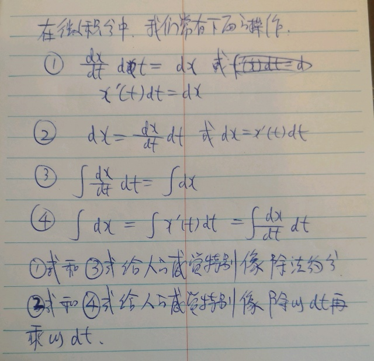
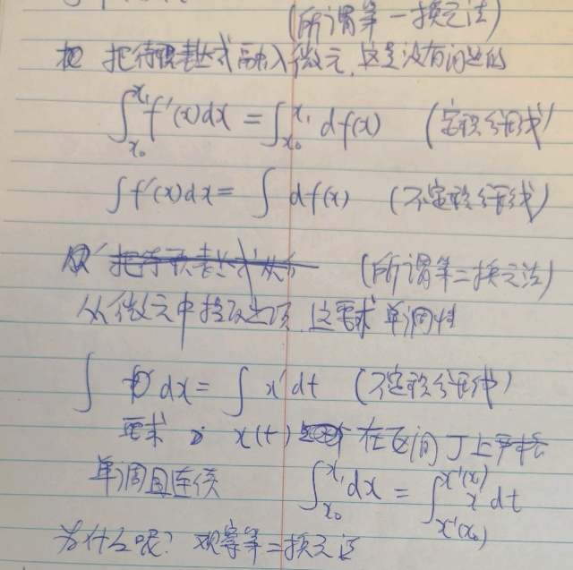
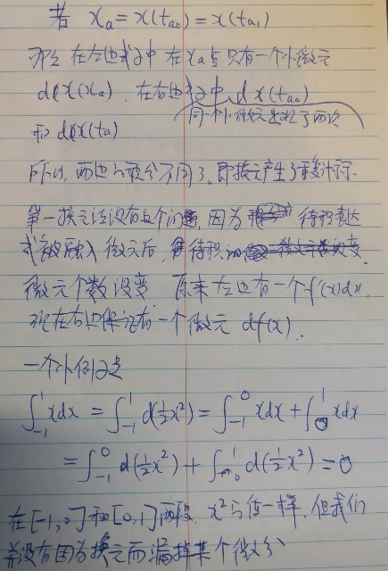
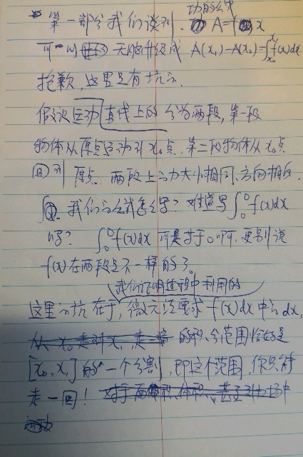
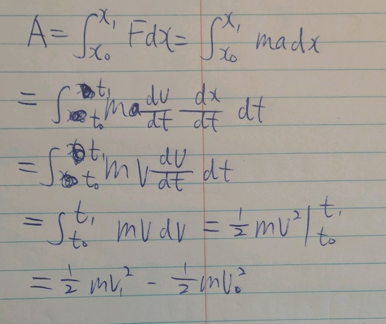

# P.为什么微积分极其易用
本帖子不定期更新，
20220722 增加了第三部分：微分形式的不变性与第一第二换元法与第四部分直线运动下的动能公式

微积分是一个界面极其友好的工具，哪怕只有中学数学的基础，只要按部就班的（无需动脑的）使用，都能立刻解决一大堆原本高不可攀的数学或物理问题。在第一部分中，我们会介绍一大堆中小学数学公式升级成微积分公式的标准方法。

但是就像软件一样，越是好用的软件，工程师们往往在后面做了越多繁琐的工作。第二部分用更严谨的数学来证明，为什么我们可以这么简单粗暴的使用微积分。

第三部分谈到了微积分更神奇的一些操作。即为什么我们可以对微分做貌似约分或者乘除法的操作。

第四部分我们灵活运用第一部分谈到的中小学公式升级版和第三部分的微积分乘除法来推导动能的定义。同时也很不幸的指出我们第一部分的无脑升级，其实还是藏了一个小坑。看来，偷懒还是有代价的。依赖直觉和类比固然是快意，该倒霉的时候也绝不含糊。

经过证明之后，我们就可以放心大胆的在日常生活中使用微积分了。啊，别忘了偶尔祈祷和有时检查。

# 用微积分给中小学公式升级

在中小学中，我们学习过大量基于常量的公式。比如下面的公式
- 力学公式
	- $v=at$。在加速度不变（为常量）的情况下，加速度乘以时间等于速度
	- $x=vt$。在速度不变（为常量）的情况下，速度乘以时间等于距离
- 功的定义
	- $A=fx$。假设力和运动的方向一致，都沿着同一条直线。在力的大小和方向保持不变（为常量）的情况下，力乘以距离等于功。
- 面积公式
	- $s=hx$。对于长方形（高度是常量），高度乘以长度等于面积
- 体积公式
	- $v=sx$。对于长方体（截面积为常量），截面积乘以长度等于体积。

这些公式都能升级。

假设我们有一个常数公式，$g= f  x$，$f$在整个过程中保持不变。在日常生活的应用中，我们总可以立刻升级成下面的微积分版本
- 积分公式：$g(x_1)-g(x_0) = \int_{x_0}^{x_1} f(x) dx$。这个公式可以用计算器来算。
- 导数公式：$dg(x)/dx = f(x)$。这个公式可以用计算器来算，还常常可以用于列方程，方程一样可以用计算器来解。
- 微分公式：$dg(x)=f(x)dx$

# 为什么中小学公式能如此简单的升级？
简单粗暴使用微积分的前提条件是，f(x)在闭区间上连续。这个条件特别强，下面的证明中我们反复运用这个条件，把一切应用微积分的琐碎困难都消除了。而现实生活中特别是物理学中，所有函数都在定义域内连续。所以自然满足条件。

下面的第几册与页数都参考<数学分析新讲>1991年9月第一版，2014年2月第14次印刷。

## 升级成积分公式

总之，只要f(x)在闭区间上连续，常数公式升级成积分公式一点问题都没有。

### 基于线性公式引入夹挤

上面证明过程的第四步我经常会纠结

在函数$f(x)$在小区间为常数a时，待求的值公式$a \Delta x$，当$f(x)$是变量时，我们怎么证明待求的值一定在$m \Delta x$和$M \Delta x$之间呢？

不过在用微元法求面积、体积和功时我反复看到这样的手法，姑且当作一个规则
- 如果函数$f(x)$在小区间为常数时，待求的值有公式$a \Delta x$
- 那么，当$f(x)$是变量时，如果m和M是$f(x)$在小区间上的最小和最大值。待求的值必然在$m \Delta x$和$M \Delta x$之间

## 升级成导数公式

第二册p81 闭区间连续函数可积

第二册p85 闭区间上可积又连续的函数f(x)，该函数变上限的积分的导数就是f(x)。

运用这个定理，由积分公式就能推出导数公式。

## 升级成微分公式

第一册p162 可微等于可导

# 微积分的乘除法

在微积分中，我们经常貌似都对微分做乘除法。微分真的能够做乘除法吗？是不是太粗糙了？

我们做的那些神操作如下

每次看到上面的操作，我都忍不住想要用中学的知识去理解，真的忍不住，因为太像了。

其实呢，式1和式2确实可以大胆的用，没有任何约束。但是，确实不是因为和中学知识的类比，而是因为“一阶微分表达形式的不变性”。

式3也可以大胆的用，叫做第一换元法。式4就有坑了。所以，盲目的拿中学知识类比或者依赖直觉是会犯错误的。虽然我知道，真的忍不住。。。

书上有关于两种换元法的证明。下面我给出一个直观的解释，为什么第二换元法有坑而第一换元法没有？

现在，让我们重新审视为什么在微分的情况下没有这么多烦恼？没有烦恼，是因为微分研究的是无穷小嘛。就算函数在整个区间内性质不好，咱们把区间对半分，无限分，在某个极小极小的区间，想要它单调还不容易吗？

这个道理在微积分中处处都能看到。在微分上的很多性质都很漂亮，麻烦的事情是如何把无穷小区间上的性质推广到整个区间上？比如
- 把函数的局部有界性推广到闭区间上的有界性
- 把费马定理推广成罗尔定理
- 把无穷小增量公式推广成拉格朗日定理

一般的方法是施加更多的约束条件，尤其是“闭区间连续”这个条件。相信看过第二部分的你，对这个条件的威力一定印象深刻吧？

# 直线运动下的动能公式

在第二部分证明“为什么我们可以无脑升级中小学公式”的时候，我说功的公式也能升级，但其实这是有限制的。

这不是微元法的错，是我们直接运用了一个结论，而忽略了这个结论推理过程中的假设。如果我们细致使用微元法重新推理，整个运动过程会形成两个积分的和$\int_{0}^{x_1} f_{1}(x) d x+\int_{x_2}^{0}  f_{2}(x) d x$。在数学书上，你经常会看到求特殊图形的面积，“需要x把图形分成多个部分来求解，每个部分运用基于积分的面积公式”，这也同样是为了避免超出范围的运用结论。

在功的求解问题中，如果我们想避免繁琐的讨论，我们其实不应该用普通积分，而应该用曲线积分了。当然，在物理书上我们推导引力所做的功时，还是可以用普通积分的。因为引力场是保守场，功与路径无关。即不管物体的运动路径如何百转千回，咱就把它想成一往无前永不回头就行。

好了，现在让我们自我限制，还是用普通积分，解决直线上运动方向不变的物体的动能公式，这是第一部分和第三部分的灵活运用。

在这个过程中，我们各种代换用到飞起，就像中学数学一样惬意。但是背后都是有各种定理保证的。特别是$\int_{x_{0}}^{x_{1}} m a d x=\int_{t_{0}}^{t_{1}} m \frac{d v}{d t} \frac{d x}{d t} d t$这一步，实际上是第二换元法。之所以成立，恰恰多亏了我们之前的限制条件“运动方向不变”，所以x是t的单调函数。

这么看来，第一换元法和第二换元法真的不是用来计算各种奇怪积分用的，毕竟今天各种数学软件都非常强大。它们更大的用途是用来推理各种有意义的、人能理解的结论。
